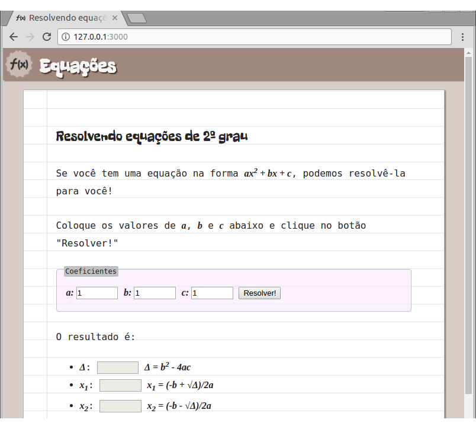
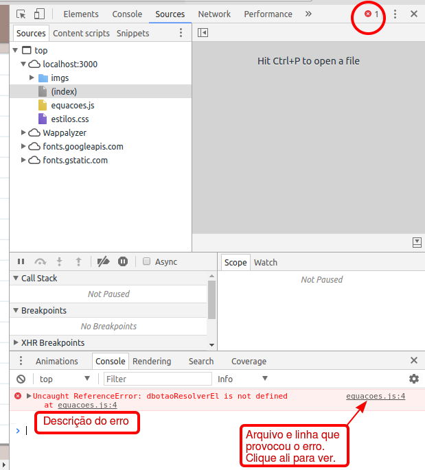

# Equações

Faça uma página para ~~roubar na prova de matemática~~ resolver equações
de 2º grau!

## Atividade

Você deve concluir a página que calcula as raízes de equações de 2º grau. Para isso, siga os exercícios.

### Exercício 1: completando o HTML

**Complete o arquivo HTML** com outro `input` para o coeficiente _c_ e um `button` "Resolver!". Eles devem estar dentro da `section` `#coeficientes-da-equacao`. Veja o slide sobre [como criar um `input`][input] que recebe números e o slide sobre [como criar um `button`][button].

Agora, crie um arquivo JavaScript vazio e o inclua no arquivo HTML, logo antes do fechamento do `body`. Veja os slides sobre [como incluir um arquivo JavaScript][incluindo-js].

### Exercício 2: clique no botão

Recupere, do DOM, o elemento HTML que representa o botão <kbd>Resolver!</kbd> e coloque-o numa variável. Veja [como recuperar um elemento do DOM][recuperar-elemento-dom].

Então, atrele uma função para ser executada ao clique do botão. Dentro dela, coloque código para exibir uma mensagem de alerta com um textinho qualquer, usando a função `window.alert('string com um texto');`.

### Exercício 3: cálculo do discriminante (Δ)

Na função atrelada ao evento de clique do botão, escreva código JavaScript para:

1. Pegar o valor de cada coeficiente e colocá-los em variáveis
   - Veja como [pegar o valor][valor-do-input] escrito pelo usuário em um elemento `input`
1. Calcular o valor do discriminante (Δ)
   - Veja os [operadores em JavaScript][operadores]
   - Veja algumas [funções matemáticas adicionais][funcoes-matematicas] em JavaScript
1. Definir o valor do `input` `#resultado-delta` como o valor encontrado para o discriminante

### Exercício 4: cálculo das raízes

Ainda na mesma função:

- se Δ for maior ou igual a 0:
  - calcular o valor de x₁ e definir devidamente o valor do `input` correspondente ao seu resultado
  - fazer o mesmo para x₂
- se Δ for menor que 0:
  - definir o valor dos `input`s das raízes como uma string vazia (isto é, `''`)

### Desafio 1: verificando `a !== 0`

Antes de calcular o valor do discriminante, verifique se o valor do **coeficiente _a_** digitado pelo usuário é **diferente de 0**.

Se ele for igual a 0, a equação não é de 2º grau. Nesse caso, **exiba uma mensagem de alerta** informando isso ao usuário. Além disso, interrompa a execução da função (com um `return;`) para que os cálculos não sejam feitos.

### Desafio 2: mais cálculos

Além dos valores do discriminante (Δ) e das raízes, **escreva no resultado também**:

1. a **quantidade de raízes** reais diferentes (de acordo com o discriminante)
1. se a **parábola está virada para cima ou para baixo**
1. a posição **(x,y) do vértice** da parábola

## FAQ

1. Escrevi o **código JavaScript mas não está funcionando**. Por quê?
   - É necessário investigar. Para isso, abra a ferramenta do desenvolvedor e procure por erros no console.

   

[input]: https://fegemo.github.io/cefet-front-end/classes/js1/#campo-de-entrada-numerica
[button]: https://fegemo.github.io/cefet-front-end/classes/js1/#botoes-de-acao
[incluindo-js]: https://fegemo.github.io/cefet-front-end/classes/js1/#incluindo-js
[recuperar-elemento-dom]: https://fegemo.github.io/cefet-front-end/classes/js1/#recuperando-elemento-dom
[valor-do-input]: https://fegemo.github.io/cefet-front-end/classes/js1/#valor-do-input
[operadores]: https://fegemo.github.io/cefet-front-end/classes/js1/#operadores
[funcoes-matematicas]: https://fegemo.github.io/cefet-front-end/classes/js1/#funcoes-matematicas
