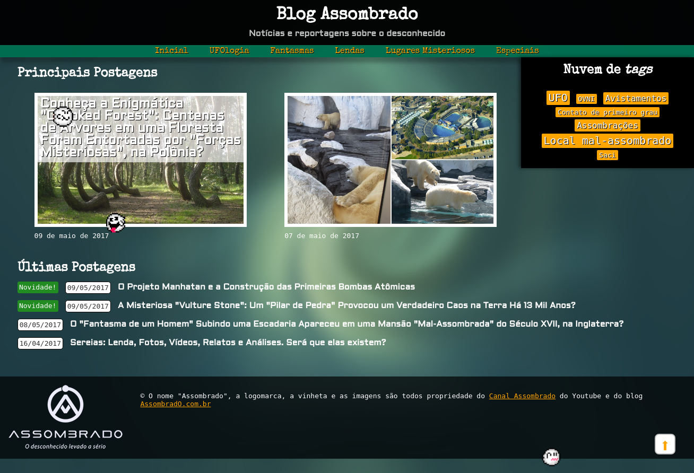
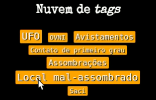
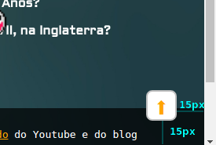
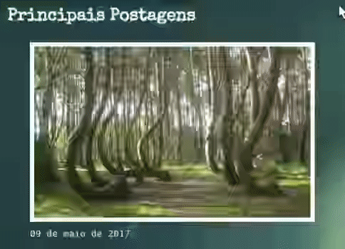
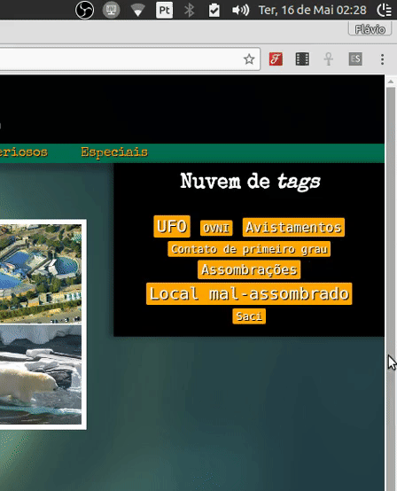

# Blog Assombrado

Um blog sobre o desconhecido **versão 2**.

## Atividade

Você deve fazer mais algumas adaptações no blog assombrado e o resultado final pode ser visto a seguir. Nosso objetivo é treinar o uso da propriedade `position`, das propriedades `top, right, bottom, left` e `z-index`.



Lembre-se de reduzir a duração do vídeo para agilizar o seu exercício (vide [FAQ](#faq)).

## Exercício 1: _tags_ parecendo botões

Estilize as _tags_ que ficam na nuvem de _tags_ (elemento `#tags`) de forma que, ao serem clicadas¹, elas sejam **deslocadas** `2px` para cima e `2px` para a esquerda da posição onde elas estão originalmente posicionadas.

- Veja [os valores para a propriedade `position`][propriedade-position] para decidir se neste caso deve ser usado `static`, `relative`, `absolute` ou `fixed`.




Além de alterar a posição das _tags_ quando clicadas, altere também o cursor do mouse. Veja [como alterar o cursor no FAQ](#faq).

### ¹: "ao serem clicadas"

Podemos usar a pseudo-classe `:active` para estilizar elementos no momento em que estão sendo clicados. Você já usou isso para estilizar _links_ da seguinte forma:

```css
a:link {
}

a:visited {
}

a:hover {
}

a:active {
  /* se aplica aos <a>...</a> quando estão sendo clicados */
}
```

Repare que **é possível usar `:active`** não apenas nas _tags_ `<a>...</a>` (de hiperlinks), mas **em qualquer elemento**.

## Exercício 2: títulos em cima das imagens

Na seção das principais postagens (elemento `#posts-principais`), estilize cada `<article class="post">...</article>` de forma que o título da postagem fique em cima da imagem, em vez de abaixo. Além da posição, coloque um fundo semitransparente (tipo `background-color: rgba(255, 255, 255, 0.5);`).


## Exercício 3: botão "voltar ao topo" ⬆️

Ao final do `<main>...</main>`, crie um hiperlink com `href="#topo-da-pagina"` (que é o `id` que o professor colocou no `<header></header>`) e o estilize para que fique sempre à direita e abaixo, como na imagem a seguir:



Quando a página rolar, o botão deve permanecer sempre a `15px` de distância à direita e abaixo em relação à janela, e não à página (_i.e._, ele nunca sai do lugar, mesmo quando o usuário rolar a barra de rolagem).

Já existem duas regras CSS que se aplicam a esse elemento - basta que você **coloque um `id` igual a `"voltar-topo"`** nesse elemento que ele ficará estilizado com a setinha, o tamanho e a borda, **faltando apenas seu posicionamento**.


## Desafio 1: fantasmas **Boo**


Coloque alguns (3) _boos_ do Super Mario para assombrar a página, ao final do `<main></main>`. Eles devem estar posicionados de forma que acompanhem a rolagem da página (e não da janela). As posições x,y deles devem ser definidas por você e não precisam estar igual na imagem do resultado final.

Há três imagens na pasta `imgs`:

- `imgs/boo1.gif`
- `imgs/boo2.gif`
- `imgs/boo3.gif`

Quando o mouse passar sobre² um _boo_, ele deve ficar semitransparente - propriedade `opacity` com algum valor entre 0 (transparente) e 1 (opaco). Afinal, é isso que fantasmas fazem.

Se quiser, você pode alterar seu tamanho (coloquei `width: 40px` nos meus) e também invertê-los horizontalmente para fazê-los olharem para a esquerda (veja o [FAQ](#faq)).

<!-- Ao terminar de estilizá-los, coloque uma classe `boo` em seus elementos de imagens e, então, inclua o arquivo `boos.js` na página. Veja [como incluir um arquivo JavaScript no FAQ](#faq). -->

### ²: "mouse passar sobre"

Lembre-se da pseudo-classe `:hover` que costumamos usar para _links_ mas podemos usar para estilizar qualquer elemento no momento em que o mouse paira sobre ele.

## Desafio 2: título visível apenas no `:hover`

Em vez de ter o título sempre visível, faça com que o texto apareça apenas quando o mouse estiver em cima do `article.post`, como no vídeo a seguir:



Como eu fiz:

- Os títulos (`.titulo`) dentro de `.post` que está nesta seção (`#posts-principais`) possuem:
  - `top: 20px`
  - `opacity: 0`  
- Quando o `.post` está em `:hover`, o `.titulo` tem:
  - `top: 6px`
  - `opacity: 1`

Por fim, é possível fazer com que a `opacity` e o `top` variem lentamente entre (`0` e `1`) e (`20px` a `6px`). Veja no [FAQ como configurar uma transição](#faq).


## Desafio 3: "nuvem de _tags_" grudenta

Existe um outro valor para a propriedade `position` chamado `sticky` (grudento). A ideia é não deixar que alguns elementos "saiam de vista" quando a página é rolada para baixo.



Neste exercício, queremos deixar a nuvem de _tags_ (elemento `#tags`) grudenta, de forma que, quando a página for rolada, ela acompanhe a rolagem. Isso pode ser feito facilmente com o posicionamento `sticky`. Pesquise na Internet como fazer isso.


## FAQ

1. Toda hora tenho que **assistir o vídeo**?? Sacanagem, né?!
   - No arquivo `index.html`, ao final do `<body>...</body>` há um pequeno
     código JavaScript que faz o vídeo sumir e o conteúdo principal aparecer
   - Altere o tempo (de 11s) para algo menor
1. Como alterar o **cursor do mouse**?
   - Em CSS existe a propriedade `cursor` e, com o valor `pointer`, o mouse fica com o desenho de "dedinho clicando"
   - Ao dizer que um elemento tem `cursor: pointer`, por exemplo, o navegador entende que o desenho do mouse deve ser alterado quando ele estiver sobre esse elemento
1. Como **configurar uma transição**?
   - Veremos a sintaxe completa em uma aula futura mas, por hoje, para que um elemento altere suas propriedades "lentamente", basta usar nele a propriedade `transition` da seguinte forma:
     ```css
     .boo {
       opacity: 0;
       transition: all 200ms ease; /* <---- */
     }
     .boo:hover {
       opacity: 1;
     }
     ```
     - Neste caso, em vez de ir de 100% transparente para 100% opaco de uma vez, a opacidade varia de 0 até 1 ao longo de 200 milissegundos.
1. Como **inverter uma imagem** horizontalmente?
   - Veremos como fazer transformações em elementos em outra aula mas, por ora, se quiser inverter um elemento horizontal, você pode usar a propriedade `transform` nele da seguinte forma:
     ```css
     .elemento-virado {
       transform: scaleX(-1);
     }
     ```

<!-- 1. Como incluir um **arquivo JavaScript**?
   Para incluir um arquivo JavaScript em uma página HTML, basta usar a _tag_ `<script src="..."></script>` e passar, no atributo `src`, o caminho para o arquivo:
   ```html
   <script src="caminho-para-arquivo.js"></script>
   ``` -->


[propriedade-position]: https://fegemo.github.io/cefet-front-end/
